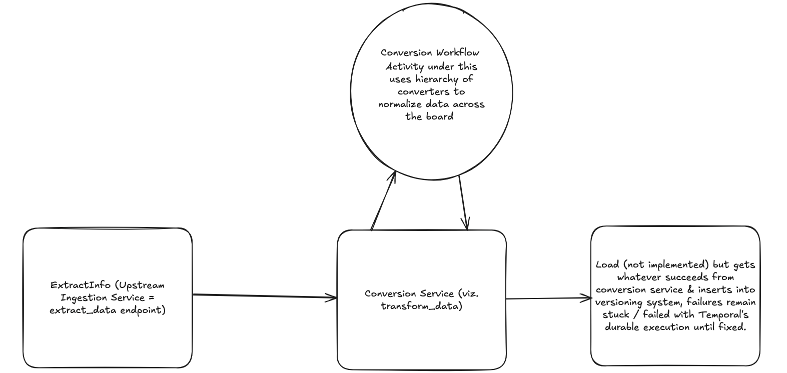
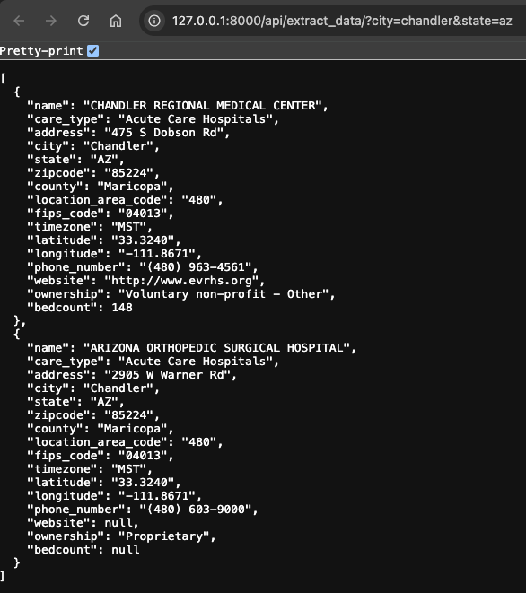
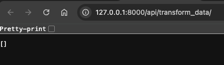
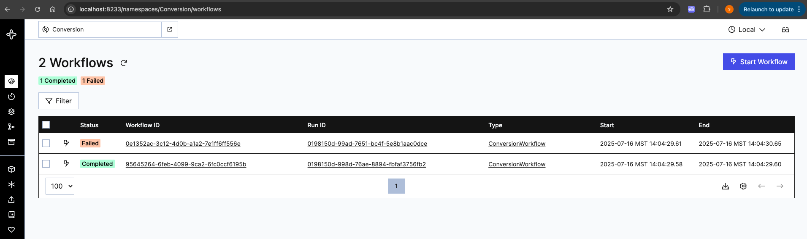
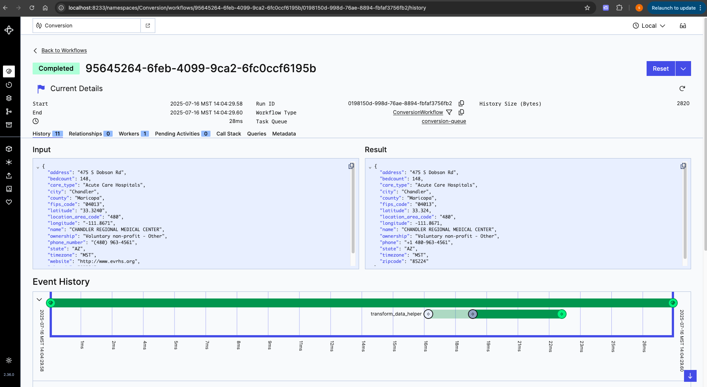
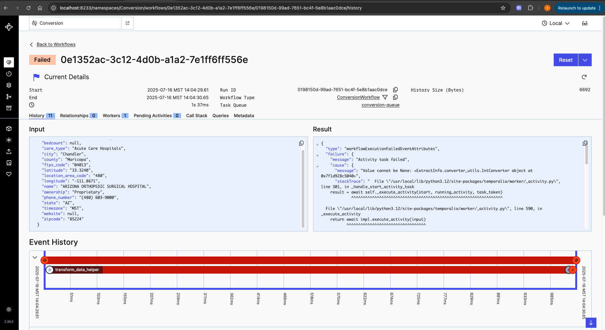

# HospitalSearch

This repo is proof of concept for how Temporal can be leveraged in ETL environment.

Let's say endpoint http://127.0.0.1:8000/api/extract_data represents upstream endpoint responsible for fetching 
hospital data from various websites. (represents E in ETL)

Let's say endpoint http://127.0.0.1:8000/api/transform_data represents endpoint responsible for converting data 
into normalized form across the board. (represents T in ETL)

I worked previously in an environment where upstream service brought in data from various heterogeneous websites.
I was part of conversion team where our downstream needed all versions of incremental data (converted = normalized). 
If this conversion logic happens to be wrong, we had to find all errors & re-run same updates. With Temporal, error 
tracking & task of making sure all versions get converted correctly, becomes easier. Also with Temporal, its easy to 
guard partial updates to downstream if upstream data is missing.

Please refer below architectural diagram.




## Prerequisites

- Create a `.env` file in the project root and add your API key:
  Ingestion endpoint uses [this](https://api-ninjas.com/api/hospitals) endpoint to get the data from.
  ```env
  API_NINJAS_KEY='your_api_key_here'
  ```

- Create a [local setup for docker](https://docs.docker.com/compose/install/) so to successfully run docker commands.


## Running the App with Docker Compose

1. Build and start all services:
   Go to project root and run:
   ```bash
   docker-compose up
   ```
   This will start the Django app, Temporal workers services defined in `docker-compose.yml`.

2. Access the Django app:
   - Open [http://localhost:8000](http://localhost:8000) in your browser.

3. Create Temporal server locally:
   - Using [temporal cli](https://docs.temporal.io/cli), create local Temporal server with Conversion namespace:

     ```bash
     temporal namespace register --namespace Conversion
     ```
     
   - Start the Temporal server locally:
     ```bash
     temporal server start-dev --namespace Conversion
     ```
     - Open [temporal web ui](http://localhost:8233) in your browser.


## Django Endpoints

- Extract hospital data:
  `http://127.0.0.1:8000/api/extract_data/?city=chandler&state=az`
- Transform hospital data:
  `http://127.0.0.1:8000/api/transform_data`

## Sample Output

1. `http://127.0.0.1:8000/api/extract_data/?city=chandler&state=az`



2. `http://127.0.0.1:8000/api/transform_data`



3. [Temporal web ui](http://localhost:8233/namespaces/Conversion/workflows)



4. When workflow succeeds



5. When workflow fails / stuck




## Notes
- Please make sure your web and Temporal workers are healthy before running workflows.
